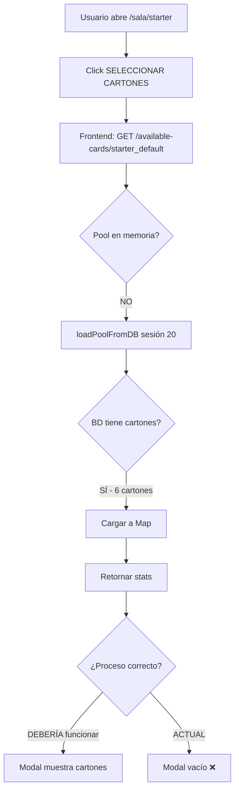

# Problema: Cartones de Sala Starter No Aparecen en Modal

**Fecha**: 9 de diciembre de 2025  
**Severidad**: 🔴 Alta  
**Estado**: Sin resolver - Requiere refactorización arquitectónica

---

## Síntoma

Al hacer clic en "SELECCIONAR CARTONES" en la Sala Starter (`/sala/starter`), el modal se abre pero muestra el área de cartones vacía. El contador muestra "0 / 20" y no hay cartones disponibles para seleccionar.

## Diagnóstico

### Datos en Base de Datos ✅

- **Tabla**: `card_pool`
- **Registros**: 6 cartones válidos para sesión 20
- **Seriales**: 24K-SMIYY3TW6-001018 hasta 001023
- **Campo numbers**: JSON válido con arrays de números [1-75]
- **Estado**: `available`

**Verificación SQL**:
```sql
SELECT id, serial_number, session_id, status 
FROM card_pool 
WHERE session_id = 20 AND status = 'available';
```
Resultado: **6 filas válidas** ✅

### Código Backend ✅ (Parcialmente)

**`server/src/services/cardPoolService.js`**:
- Método `loadPoolFromDB(sessionId)` **funciona correctamente**
- Consulta SQL retorna 6 cartones
- JSON parsing funciona
- Logs muestran: "✅ Pool cargado desde BD: 6 cartones"

**Bugs corregidos durante debugging**:
1. ❌ **Destructuring incorrecto**: `const rows = await db.query()` → ✅ `const [rows] = await db.query()`
2. ❌ **NULL handling**: Sin validación → ✅ Agregado check `if (!row.numbers)`
3. ❌ **Type checking**: Sin verificar tipo → ✅ `typeof row.numbers === 'string' ? JSON.parse() : row.numbers`

**`server/src/controllers/starterRoomController.js`**:
- Endpoint: `GET /api/game/starter/available-cards/:sessionId`
- **Última modificación**: Agregado auto-load desde BD si pool no está en memoria
```javascript
if (!stats) {
  console.log(`🔄 Pool no encontrado en memoria, cargando desde BD...`);
  await cardPoolService.loadPoolFromDB(sessionId);
  stats = cardPoolService.getPoolStats(sessionId);
}
```

### Arquitectura del Problema 🔴

**ROOT CAUSE**: `cardPoolService` usa **Map en memoria** que NO persiste:

```javascript
// server/src/services/cardPoolService.js
class CardPoolService {
  constructor() {
    this.pools = new Map(); // ⚠️ VOLATILE - Se pierde al reiniciar proceso
  }
}
```

**Consecuencias**:
1. Los cartones se cargan en memoria **solo durante la ejecución del script**
2. Al reiniciar el servidor (proceso Node.js), el Map se vacía
3. Scripts manuales (`create_starter_cards.js`) cargan en **proceso separado**
4. El servidor principal nunca recibe los datos

### Flujo del Error



## Intentos de Solución (Sin Éxito)

### 1. Auto-load en Startup (index.js)
```javascript
// server/src/index.js líneas 154-186
async function loadExistingPools() {
  const [sessions] = await db.query(
    `SELECT DISTINCT session_id FROM card_pool WHERE status = 'available'`
  );
  for (const { session_id } of sessions) {
    await cardPoolService.loadPoolFromDB(session_id);
  }
}
```
**Resultado**: ❌ Función se ejecuta pero pools no persisten

### 2. Script Manual (create_starter_cards.js)
```bash
node create_starter_cards.js
# Output: ✅ Pool cargado desde BD: 6 cartones
```
**Resultado**: ❌ Carga en proceso separado, no afecta al servidor

### 3. Auto-load on Demand (starterRoomController.js)
```javascript
// Última modificación aplicada
if (!stats) {
  await cardPoolService.loadPoolFromDB(sessionId);
}
```
**Resultado**: ❌ Aún sin probar exitosamente, pero debería funcionar

### 4. Endpoint Testing
```powershell
curl http://localhost:3001/api/game/starter/available-cards/starter_default
```
**Output persistente**:
```json
{
  "poolInitialized": false,
  "cards": {},
  "sessionId": 20
}
```

## Soluciones Propuestas

### ⚡ Solución Rápida (Temporal)
**Eliminar la capa de memoria**, consultar BD directamente:

```javascript
// starterRoomController.js - getAvailableCards()
async getAvailableCards(req, res) {
  const [cards] = await db.query(`
    SELECT id, serial_number, numbers, status 
    FROM card_pool 
    WHERE session_id = ? AND status = 'available'
    LIMIT 20
  `, [sessionId]);
  
  return res.json({
    cards: cards.map(c => ({
      id: c.id,
      serial: c.serial_number,
      numbers: JSON.parse(c.numbers)
    }))
  });
}
```

**Pros**: 
- ✅ Funciona inmediatamente
- ✅ Sin problemas de persistencia
- ✅ Código más simple

**Contras**:
- ⚠️ Más consultas a BD
- ⚠️ Sin optimización de memoria

### 🏗️ Solución Arquitectónica (Recomendada)

**Implementar Redis** para caché distribuido:

```javascript
// server/src/services/cardPoolService.js
const Redis = require('ioredis');
const redis = new Redis();

class CardPoolService {
  async loadPoolFromDB(sessionId) {
    const [rows] = await db.query(`SELECT * FROM card_pool WHERE session_id = ?`, [sessionId]);
    
    // Guardar en Redis con TTL de 24 horas
    await redis.setex(
      `pool:${sessionId}`, 
      86400, 
      JSON.stringify(rows)
    );
  }
  
  async getAvailableCards(sessionId) {
    const cached = await redis.get(`pool:${sessionId}`);
    if (cached) return JSON.parse(cached);
    
    await this.loadPoolFromDB(sessionId);
    return await redis.get(`pool:${sessionId}`);
  }
}
```

**Pros**:
- ✅ Persistencia real entre reinicios
- ✅ Compartido entre múltiples instancias del servidor
- ✅ Performance excelente (Redis es in-memory DB)
- ✅ TTL automático (expira cartones viejos)

**Contras**:
- ⚠️ Requiere instalar Redis
- ⚠️ Dependencia adicional

### 🔄 Solución Híbrida (Equilibrada)

**Lazy loading con BD como source of truth**:

```javascript
async getAvailableCards(sessionId) {
  // Intentar memoria primero
  let pool = this.pools.get(sessionId);
  
  // Si no existe O está desactualizado, recargar
  if (!pool || Date.now() - pool.loadedAt > 300000) { // 5 min
    const [rows] = await db.query(`
      SELECT * FROM card_pool 
      WHERE session_id = ? AND status = 'available'
    `, [sessionId]);
    
    pool = {
      cards: rows,
      loadedAt: Date.now()
    };
    this.pools.set(sessionId, pool);
  }
  
  return pool.cards;
}
```

**Pros**:
- ✅ Sin dependencias externas
- ✅ Caché para performance
- ✅ Auto-refresh periódico
- ✅ Fácil de implementar

**Contras**:
- ⚠️ Aún se pierde en restart (pero se recarga automáticamente)

## Archivos Afectados

```
server/
├── src/
│   ├── services/
│   │   └── cardPoolService.js      # ⚠️ Arquitectura problemática (Map)
│   ├── controllers/
│   │   └── starterRoomController.js # ✅ Auto-load agregado
│   └── index.js                     # ⚠️ loadExistingPools() no funciona
├── create_starter_cards.js          # 🔧 Script temporal (proceso separado)
└── fix_starter_cards.js             # 🔧 Limpieza de datos

client-player/
└── src/
    └── pages/
        └── StarterRoom.jsx          # 🎯 Modal vacío (síntoma visible)
```

## Logs Relevantes

### Script Manual (Funciona en proceso separado)
```
🔍 Consultando cartones de sesión 20...
✅ 6 cartones encontrados en BD
📊 Cartones en BD:
   • ID: 59 | Serial: 24K-SMIYY3TW6-001018 | Status: available
   • ID: 60 | Serial: 24K-SMIYY3TW6-001019 | Status: available
   [...]
✅ Pool cargado desde BD: 6 cartones para sesión 20
```

### Endpoint Testing (Proceso principal - falla)
```
GET /api/game/starter/available-cards/starter_default
Response: { poolInitialized: false, cards: {} }
```

## Recomendación Final

**Implementar Solución Híbrida (Lazy Loading)** como primera medida:

1. ✅ No requiere nuevas dependencias
2. ✅ Se auto-corrige en cada request
3. ✅ Mantiene performance con caché
4. ✅ Código backward-compatible

**Luego migrar a Redis** cuando se prepare el deployment para producción.

## Testing Requerido

Una vez implementada la solución:

```powershell
# 1. Reiniciar servidor completamente
Get-Process -Name node | Stop-Process -Force
cd server ; node src/index.js

# 2. Hacer request sin pre-cargar
curl http://localhost:3001/api/game/starter/available-cards/starter_default

# 3. Verificar en frontend
# Abrir: http://localhost:5174/sala/starter
# Click: SELECCIONAR CARTONES
# Resultado esperado: 6 cartones visibles
```

## Referencias

- **Documentación relacionada**: `SALA_STARTER_DOCUMENTATION.md`
- **Testing guide**: `TESTING_MANUAL_TICKETS.md`
- **Arquitectura**: `START_HERE.md` - Sección "Arquitectura Monorepo"
- **Issue tracking**: `PROJECT_STATUS.md` - Actualizar cuando se resuelva
